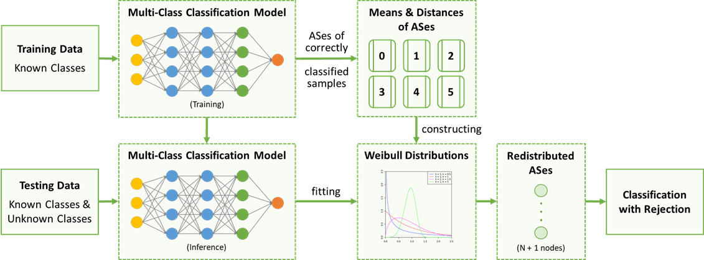

# Server Tuning

## Goal

This project aims to identify **optimal system configurations** to accelerate server performance. The main challenge stems from the **diversity of workloads** and the **combinatorial explosion of configuration options**, making brute-force exploration both time-consuming and costly.

---

## Observation

* **Different tasks may share similar configuration needs**

  *Example:* Both **video downloading** and **backup** tasks benefit from similar I/O tuning strategies.

---

## Approach

1. **Classify Tasks**: Use performance counters to identify and categorize the I/O patterns of different tasks.

2. **Tune System Settings Based on Classification**: Apply pre-validated configuration templates for each I/O pattern class.

---

## Environment Settings

* **Server**: HPE ProLiant DL380 Gen10 Plus
* **CPU**: 2 × Intel Xeon Gold 5317
* **DRAM**: 4 × 32 GB DDR4
* **System**: Windows Server 2022 Datacenter
* **Storage**: 3 × 6.4 TB NVMe SSDs

---

## ML Pipeline

### 1. Data Collection

Performance data was gathered by running representative workloads while profiling system metrics.

* **Raw Shape**: `(61, 103)`

  * 61 time intervals × 103 performance counters

* **Performance Counter Categories**:

  * **Cache** (e.g., Copy Reads/sec) — file system cache
  * **Memory** (e.g., Available Bytes, Page Faults/sec)
  * **Logical Disk (D:)** (e.g., Disk Transfers/sec)
  * **Physical Disk** — identical to logical disk due to RAID abstraction
  * **Process** (e.g., Processor Time, Thread Count)

---

### 2. Data Preprocessing

* **Missing Values**: Replaced with 0
* **Feature Selection**: Performed using CART

  * Dimensionality reduced: **156 → 103**

---

### 3. Model Training

* **Model Type**: Fully-connected DNN
* **Input Shape**: `(batch_size, 61, 103)`
* **#Classes**: 6
* **Loss**: `CrossEntropyLoss`
* **Optimizer**: `Adam`
* **#Parameters**: \~14M
* **Model Size**: 53.36 MB

#### 🔧 Architecture

```py
----------------------------------------------------------------
        Layer (type)               Output Shape         Param #
================================================================
         Flatten-1               [B, 6283]                   0
          Linear-2               [B, 2048]             12,872,192
       LeakyReLU-3               [B, 2048]                   0
          Linear-4               [B, 512]              1,049,088
       LeakyReLU-5               [B, 512]                    0
          Linear-6               [B, 128]                65,664
       LeakyReLU-7               [B, 128]                    0
          Linear-8               [B, 6]                     774
================================================================
```

---

### 4. Optimization – Rejection Handling

**Problem:**
10% of unseen workloads are misclassified due to insufficient representation in the training data.

**Solution:**
Incorporate **OpenMax** to detect and reject extreme or out-of-distribution inputs.

**Implementation:**

1. **During training**: Capture penultimate-layer activation vectors and fit a **Weibull distribution** for each class.
2. **During testing**: If the activation vector is far from all class centers (beyond a modeled threshold), reject the sample.



---

### 5. Model Evaluation
* **#Training Samples**: 5,000
  * **Split**: 4,550 (train) / 506 (validation)
* **#Testing Samples**: 575

* **Accuracy Definition**:

  $$
  \text{Accuracy} = \frac{\text{Correct Predictions}}{\text{Total Samples}}
  $$

* **Accuracy**:
<div align="center">

<table>
  <thead>
    <tr>
      <th>Task Type</th>
      <th>Accuracy</th>
    </tr>
  </thead>
  <tbody>
    <tr>
      <td>DNN</td>
      <td>0.97</td>
    </tr>
    <tr>
      <td>CNN</td>
      <td>0.94</td>
    </tr>
    <tr>
      <td>NLP</td>
      <td>0.88</td>
    </tr>
  </tbody>
</table>

</div>

---

## Options Tuning

Based on the predicted class, the system automatically applies the corresponding configuration to enhance performance.

---

## Results

The proposed method achieves an **average performance gain of 1.43×** across tested workloads.