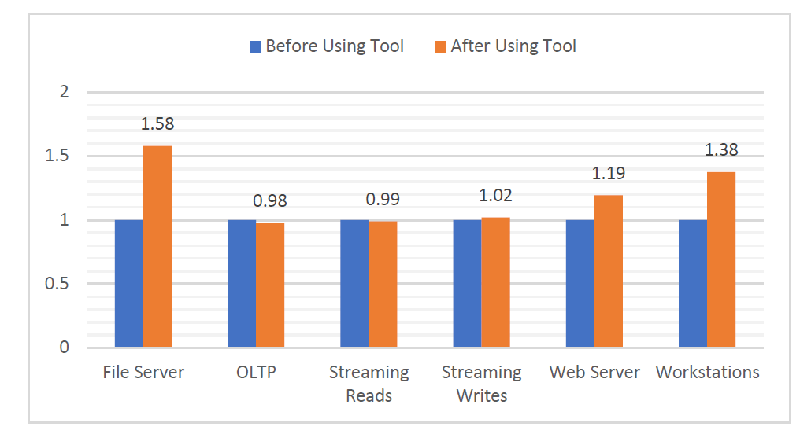

# Server Tuning

## Goal

This project aims to identify optimal system configurations to accelerate server performance. However, the challenge lies in the high diversity of tasks and the vast number of possible configuration combinations, making this problem complex and costly to solve through brute-force exploration.

---

## Observations

* Different tasks may require the same configuration settings.
   
E.g., both video downloading and backup tasks require similar configuration settings.

--- 
## Approach

1. **Classify Tasks**  
   Use performance counters to identify and classify the I/O pattern of each task.

2. **Tune System Settings Based on Classification**  
   For each I/O pattern class, apply tailored configuration adjustments known to be effective for that type.

---

## Environment Setting
- **Server**: HPE ProLiant DL380 Gen10 Plus  
- **CPU**: 2 × Intel Xeon Gold 5317  
- **DRAM**: 4 × 32 GB DDR4  
- **System**: Windows Server 2022 Datacenter  
- **Storage**: 3 × 6.4 TB NVMe SSDs  

## ML Pipeline
### 1. Collecting Data

Performance data was collected by running a workload over time while recording system metrics using a profiling tool.

- **Raw Output Shape**: `(61, 103)` → 61 time intervals × 103 performance counters  
- **Performance Counter Types**:
  - **Cache** (e.g., Copy Reads/sec) – file system cache, not CPU cache
  - **Memory** (e.g., Available Bytes, Page Faults/sec, Transition Pages RePurposed)
  - **Logical Disk (D:/)** (e.g., Disk Transfers/sec)
  - **Physical Disk** (e.g., Disk Transfers/sec)  
    *Note: Physical disk data is identical to logical disk due to RAID controller abstraction.*
  - **Process** (e.g., Processor Time, Thread Count)

---

### 2. Preprocessing Data

- **Missing Values**: Filled with 0  
- **Feature Selection**: Irrelevant features removed using CART  
  - Feature count reduced: `156 → 103`
---

### 3. Model Training

* **Loss Function**: `CrossEntropyLoss`
* **Optimizer**: `Adam`
* **Input Shape**: `(batch_size, 61, 103)`
* **#Classes**: `6`
* **Model Type**: DNN
* **#Parameters**: **\~14 M**
* **Model Size**: **53.36 MB**

#### 🔧 Architecture

```=py
----------------------------------------------------------------
        Layer (type)               Output Shape         Param #
================================================================
         Flatten-1               [B, 6283]                   0
          Linear-2               [B, 2048]             12,872,192
       LeakyReLU-3               [B, 2048]                   0
          Linear-4               [B, 512]              1,049,088
       LeakyReLU-5               [B, 512]                    0
          Linear-6               [B, 128]                65,664
       LeakyReLU-7               [B, 128]                    0
          Linear-8               [B, 6]                     774
================================================================
```

### 4. Optimization: Rejecting

**Issue:**

10% of unseen tasks cannot be correctly classified.

**Method:**

Apply OpenMax to reject extreme inputs and avoid incorrect predictions.

**Approach:**

1. During training, use the activation vectors from the penultimate layer of the classifier to fit a Weibull distribution for each known class.

2. During testing, if the activation vector of an input is far from all class centers (i.e., the distance exceeds the modeled distribution), the input is considered an extreme value and is rejected.


### 5. Model Testing
Metrics:

$$
\text{Accuracy} = \frac{\text{Number of Correct Predictions}}{\text{Total Number of Samples}}
$$

| Task Type | Accuracy |
| --------- | -------- |
| DNN       | 0.97     |
| CNN       | 0.94     |
| NLP       | 0.88     |

### 5. Options Tuning
Based on the predicted class, corresponding options are applied to improve performance.


## Results
The proposed method improves task performance by an average of 1.43× across tested workloads.
